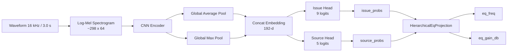
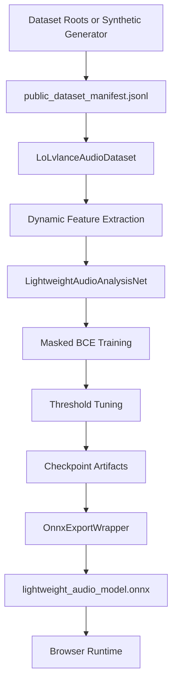

# ML README

이 문서는 LoLvlance의 ML 파트를 집중적으로 설명합니다.

- 모델 아키텍처
- 전처리
- 학습 루프
- synthetic dataset fallback
- 평가 및 export 체크

핵심은 다음 한 문장입니다.

현재 시스템은 **ML 통합과 브라우저 연동까지는 완료된 상태**이지만, 현재 체크포인트는 여전히 **synthetic-data-trained** 상태입니다.

영문 버전: `ML_README.md`

## 바로가기

[](#model-architecture)
[](#training-details)
[](#synthetic-dataset-explanation)
[](#evaluation-strategy)

[](ML_README.md)
[](README.ko.md)
[](HANDOVER.ko.md)

<a id="model-architecture"></a>
## 1. 모델 아키텍처

### Trainable Network

trainable model은 `ml/model.py`의 `LightweightAudioAnalysisNet`입니다.

구성은 다음과 같습니다.

- stacked convolutional blocks
- shared encoder
- pooled embedding
- `issue_head`
- `source_head`

현재 기본 설정값:

- mel bins: `64`
- convolution channels: `(24, 48, 72, 96)`
- head hidden dim: `96`
- dropout: `0.15`

### 아키텍처 다이어그램



### Tensor Shape 흐름

| 단계 | Shape | 설명 |
| --- | --- | --- |
| 입력 waveform | `(48000,)` | 16 kHz 기준 3.0초 |
| Log-mel spectrogram | `(time_steps, 64)` | 일반적으로 `time_steps ~= 298` |
| 모델 입력 | `(batch, time_steps, 64)` | 브라우저와 PyTorch export 계약 |
| Encoder 출력 | `(batch, channels, time', mel')` | 내부 convolution 표현 |
| Pooled embedding | `(batch, 192)` | avg pool + max pool 결합 |
| Issue logits | `(batch, 9)` | trainable issue head |
| Source logits | `(batch, 5)` | trainable source head |
| Exported EQ tensor | `(batch, 1)` | learned가 아닌 deterministic projection |

### 입력 계약

모델 입력은 다음을 기대합니다.

- dtype: `float32`
- shape: `(batch, time_steps, 64)`
- 의미: log-mel spectrogram

PyTorch에서는 `(time_steps, 64)` 형태도 받을 수 있으며, 내부에서 batch 차원이 자동으로 추가됩니다.

### PyTorch 출력 계약

원래 PyTorch forward는 다음 키를 가진 dictionary를 반환합니다.

- `issue_logits`
- `issue_probs`
- `source_logits`
- `source_probs`
- `embedding`
- `problem_logits`
- `problem_probs`

`problem_logits`, `problem_probs`는 Python 내부 호환성을 위한 legacy alias이며, frontend 추론 경로에서는 더 이상 사용하지 않습니다.

### Trainable Label

Issue label:

```text
[muddy, harsh, buried, boomy, thin, boxy, nasal, sibilant, dull]
```

Source label:

```text
[vocal, guitar, bass, drums, keys]
```

post-processing에서 사용하는 derived diagnosis label:

```text
[vocal_buried, guitar_harsh, bass_muddy, drums_overpower, keys_masking]
```

schema source-of-truth:

- Python: `ml/label_schema.py`
- Frontend mirror: `src/app/audio/mlSchema.ts`

### ONNX Export Wrapper

브라우저용 ONNX 계약은 raw PyTorch forward dictionary가 아니라 `ml/export_to_onnx.py`에서 정의됩니다.

`OnnxExportWrapper`는 다음을 반환합니다.

```text
(issue_probs, source_probs, eq_freq, eq_gain_db)
```

추가된 EQ 출력은 `ml/onnx_schema_adapter.py`의 `HierarchicalEqProjection`에서 생성됩니다.

중요:

- learned EQ head는 없습니다.
- `eq_freq`, `eq_gain_db`는 deterministic projection입니다.

<a id="training-details"></a>
## 2. 학습 상세

### 전처리

학습 전처리는 `ml/preprocessing.py`에 정의되어 있습니다.

현재 설정:

- sample rate: `16_000`
- clip length: `3.0`초
- STFT window: `25 ms`
- STFT hop: `10 ms`
- FFT size: `512`
- mel bins: `64`

feature extraction에는 다음이 포함됩니다.

- log-mel spectrogram
- RMS
- spectral centroid
- spectral rolloff
- weak label 추론에 쓰이는 여러 band-energy ratio

### 데이터 파이프라인

`ml/dataset.py`는 다음 public-style dataset root를 지원합니다.

- OpenMIC
- Slakh
- MUSAN
- FSD50K

이 파이프라인은 서로 다른 두 일을 합니다.

1. weak issue/source target과 metadata를 가진 manifest를 생성합니다.
2. 학습 시 clip을 동적으로 로딩하고 feature를 추출합니다.

manifest는 다음 정보를 저장합니다.

- `audio_path`
- `start_seconds`
- `duration_seconds`
- `split`
- `issue_targets`
- `source_targets`
- 두 head의 mask
- label-quality metadata
- `track_group_id`
- 디버깅과 분석에 유용한 feature-derived metadata

### Weak Label

Issue label은 다음 신호에서 추론됩니다.

- spectral heuristic
- dataset context
- filename hint
- Slakh형 구조에서의 stem overlap 단서

Source label은 다음 정보에서 추론됩니다.

- structured CSV annotation
- generic tag CSV field
- filename term
- stem filename

특정 source label이 unavailable이면 대응 mask가 `0`이 되고, loss는 그 label을 학습에 사용하지 않습니다.

### Loss

현재 학습 objective는 두 head만 포함합니다.

- issue head용 masked `BCEWithLogitsLoss`
- source head용 masked `BCEWithLogitsLoss`

구현 세부사항:

- training split으로부터 per-label positive weight를 계산합니다.
- source supervision이 없는 샘플은 mask로 무시합니다.
- total loss는 issue loss와 source loss의 가중합입니다.

### Optimizer와 기본값

`ml/train.py`의 현재 기본값:

- optimizer: `AdamW`
- learning rate: `1e-3`
- weight decay: `1e-4`
- batch size: `16`
- default epochs: `6`

현재 synthetic checkpoint는 아래 설정으로 학습되었습니다.

- epochs: `10`
- batch size: `16`
- learning rate: `1e-3`
- device: `cpu`

### Training Output

`ml/train.py`는 아래 파일을 생성합니다.

- `ml/checkpoints/model.pt`
- `ml/checkpoints/best_sound_issue_model.pt`
- `ml/checkpoints/last_sound_issue_model.pt`
- `ml/checkpoints/config.json`
- `ml/checkpoints/thresholds.json`
- `ml/checkpoints/label_thresholds.json`
- `ml/checkpoints/training_history.json`

`--export-onnx`를 사용하면 추가로 아래 파일도 생성합니다.

- `ml/checkpoints/lightweight_audio_model.onnx`
- `ml/checkpoints/lightweight_audio_model.metadata.json`

metadata JSON에는 다음 정보가 포함됩니다.

- schema version
- issue labels
- primary issue labels
- source labels
- derived diagnosis labels
- thresholds
- issue-to-cause mappings
- issue-to-source-affinity mappings
- fallback EQ mappings

### Training / Export 흐름



### 현재 Synthetic Run 요약

현재 검증된 run은 다음 결과를 만들었습니다.

- manifest size: `44` clips
- train split: `22`
- val split: `22`
- best epoch: `10`
- train loss: `1.4123 -> 0.5785`
- val loss: `1.3208 -> 1.1534`
- selection score: `0.7264`

이 숫자는 synthetic task에서 pipeline이 학습되고 있다는 의미일 뿐이며, production accuracy를 의미하지는 않습니다.

<a id="synthetic-dataset-explanation"></a>
## 3. Synthetic Dataset 설명

### 왜 필요한가

학습 당시 이 workspace에는 실제 public dataset root가 없었습니다.

다음 항목들을 막지 않기 위해:

- manifest generation
- dataloader validation
- training loop execution
- checkpoint writing
- ONNX export
- browser inference integration

fallback generator인 `ml/generate_synthetic_public_datasets.py`를 추가했습니다.

### 무엇을 생성하는가

이 generator는 아래 경로에 public-dataset-like directory tree를 만듭니다.

```text
ml/artifacts/synthetic_public_datasets/
```

audio clip은 다음 요소를 조합해 생성됩니다.

- sine wave
- band-limited harmonic pattern
- noise
- tremolo

그리고 구조는 다음 dataset을 흉내 냅니다.

- OpenMIC
- Slakh
- MUSAN
- FSD50K

이 덕분에 dataset scanner와 weak-label logic을 별도 예외 처리 없이 그대로 사용할 수 있습니다.

### 왜 프로덕션 데이터가 아닌가

synthetic set은 매우 단순하고 편향되어 있습니다.

예를 들면:

- source distribution이 비현실적입니다.
- timbral variation이 제한적입니다.
- instrument interaction이 단순합니다.
- label balance가 인위적입니다.
- 현재 manifest에서는 `keys`가 모든 sample에서 support를 가집니다.

마지막 항목은 중요합니다. 실제 브라우저 사용에서 모델이 `keys`를 과대예측하는 이유를 설명해 줍니다.

### 올바른 해석

synthetic checkpoint는 다음으로 해석해야 합니다.

- pipeline verification artifact
- schema validation artifact
- browser integration artifact

다음으로 해석하면 안 됩니다.

- benchmark model
- production-quality classifier
- 실제 환경에서 신뢰할 수 있는 diagnosis model

<a id="evaluation-strategy"></a>
## 4. 평가 전략

### 새 체크포인트를 받아들이기 전 최소 체크리스트

1. 학습이 runtime error 없이 끝나는가
2. 학습 과정에서 loss가 감소하는가
3. `model.forward()`가 dummy input에서 정상 동작하는가
4. ONNX export가 `onnxruntime` 검증을 통과하는가
5. 브라우저에서 모델이 로드되고 finite output을 반환하는가
6. 서로 다른 오디오 시나리오에서 raw probability가 변하는가

### Shape 및 Schema 체크

필수 ONNX 출력은 다음과 같습니다.

- `issue_probs`: `(batch, 9)`
- `source_probs`: `(batch, 5)`
- `eq_freq`: `(batch, 1)`
- `eq_gain_db`: `(batch, 1)`

frontend는 이 이름들에 정확히 의존합니다.

### Threshold 및 Metric 체크

`ml/metrics.py`는 현재 다음 지표를 제공합니다.

- per-label precision
- per-label recall
- per-label F1
- 가능할 경우 per-label AUROC
- micro metric
- macro F1
- threshold 후보 grid를 사용한 tuning

실제 데이터 학습에서는 특히 다음을 봐야 합니다.

- per-label support
- source-head coverage
- threshold stability
- 성능이 과대표집 source 하나에만 집중되지 않는지

### Output 동작 체크

체크포인트를 반영하기 전 다음을 확인해야 합니다.

- `issue_probs`가 non-constant인가
- `source_probs`가 collapse되지 않았는가
- `eq_freq`, `eq_gain_db`가 finite인가
- silence, voice, music, harsh input에서 출력이 의미 있게 달라지는가

### 브라우저 체크 시나리오

권장 브라우저 sanity 시나리오:

1. Silence
   issue activation이 거의 없거나 empty result가 나와야 합니다.
2. Voice only
   vocal 관련 source activation이 상대적으로 강해야 합니다.
3. Music playback
   상황에 따라 여러 source가 함께 활성화되어야 합니다.
4. Distorted or harsh audio
   harsh 관련 issue 차원이 어느 정도 반응해야 합니다.

### 현재 평가 결과의 의미

현재 synthetic checkpoint는 인프라 체크는 통과합니다.

- PyTorch에서 로드 가능
- ONNX export 가능
- `onnxruntime` 검증 통과
- 브라우저 로드 가능
- finite output 생성
- 시나리오별 dynamic output 생성

하지만 실제 오디오에 대한 semantic quality는 아직 기대 수준이 아닙니다.

- voice가 안정적으로 vocal-dominant하지 않음
- music source가 깔끔하게 분리되지 않음
- issue movement는 보이지만 아직 신뢰 가능한 수준은 아님

### 현재 존재하는 자동 검증

저장소에는 이미 다음 ML-side 자동 검증이 있습니다.

- `ml/tests/test_export_to_onnx.py`의 ONNX export 및 runtime 검증
- `ml/tests/test_training_pipeline.py`의 training-pipeline 검증
- `ml/tests/test_legacy_onnx_adapter.py`의 legacy-ONNX adaptation 검증

### 실무적 권고

실제 데이터 학습이 들어가기 전까지는 새 체크포인트를 주로 다음 기준으로 평가하는 것이 맞습니다.

- pipeline correctness
- schema correctness
- output variability
- numerical stability

현재 synthetic checkpoint를 가지고 제품 문제 자체가 해결되었다고 해석하면 안 됩니다.
