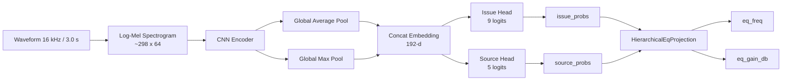
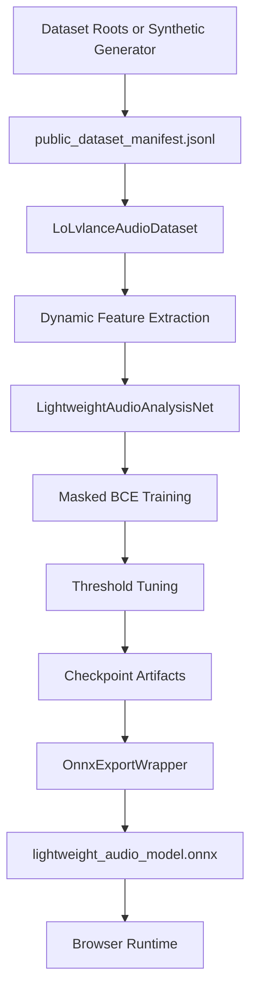

# ML README

This document covers the ML-specific part of LoLvlance:

- model architecture
- preprocessing
- training loop
- synthetic dataset fallback
- evaluation and export checks

The main point to keep in mind is that the current system is **ML-integrated and operational**, but the current checkpoint is still **synthetic-data-trained**.

Korean version: `ML_README.ko.md`

## Quick Links

[](#model-architecture)
[](#training-details)
[](#synthetic-dataset-explanation)
[](#evaluation-strategy)

[](ML_README.ko.md)
[](README.md)
[](HANDOVER.md)

<a id="model-architecture"></a>
## 1. Model Architecture

### Trainable Network

The trainable model lives in `ml/model.py` as `LightweightAudioAnalysisNet`.

It is a lightweight CNN with:

- stacked convolutional blocks
- shared encoder
- pooled embedding
- `issue_head`
- `source_head`

Current configuration defaults:

- mel bins: `64`
- convolution channels: `(24, 48, 72, 96)`
- head hidden dim: `96`
- dropout: `0.15`

### Architecture Diagram



### Tensor Shape Flow

| Stage | Shape | Notes |
| --- | --- | --- |
| Input waveform | `(48000,)` | 3.0 seconds at 16 kHz |
| Log-mel spectrogram | `(time_steps, 64)` | Typical `time_steps ~= 298` |
| Model input | `(batch, time_steps, 64)` | Browser and PyTorch export contract |
| Encoder output | `(batch, channels, time', mel')` | Internal convolutional representation |
| Pooled embedding | `(batch, 192)` | Avg pool + max pool concatenation |
| Issue logits | `(batch, 9)` | Trainable issue head |
| Source logits | `(batch, 5)` | Trainable source head |
| Exported EQ tensors | `(batch, 1)` | Deterministic projection, not learned |

### Input Contract

The model expects:

- dtype: `float32`
- shape: `(batch, time_steps, 64)`
- semantic meaning: log-mel spectrogram

The input can also be provided as `(time_steps, 64)` in PyTorch and is expanded to batch form internally.

### Output Contract in PyTorch

The raw PyTorch forward pass returns a dictionary containing:

- `issue_logits`
- `issue_probs`
- `source_logits`
- `source_probs`
- `embedding`
- `problem_logits`
- `problem_probs`

`problem_logits` and `problem_probs` are legacy aliases of the issue head inside Python only. They are not used by the frontend inference path anymore.

### Trainable Labels

Issue labels:

```text
[muddy, harsh, buried, boomy, thin, boxy, nasal, sibilant, dull]
```

Source labels:

```text
[vocal, guitar, bass, drums, keys]
```

Derived diagnosis labels used by post-processing:

```text
[vocal_buried, guitar_harsh, bass_muddy, drums_overpower, keys_masking]
```

Schema source-of-truth:

- Python: `ml/label_schema.py`
- Frontend mirror: `src/app/audio/mlSchema.ts`

### ONNX Export Wrapper

The browser-facing ONNX contract is defined by `ml/export_to_onnx.py`, not by the raw PyTorch forward dictionary.

`OnnxExportWrapper` returns:

```text
(issue_probs, source_probs, eq_freq, eq_gain_db)
```

The extra EQ outputs come from `HierarchicalEqProjection` in `ml/onnx_schema_adapter.py`.

Important:

- there is no learned EQ head
- `eq_freq` and `eq_gain_db` are deterministic projections

<a id="training-details"></a>
## 2. Training Details

### Preprocessing

Training preprocessing is defined in `ml/preprocessing.py`.

Current configuration:

- sample rate: `16_000`
- clip length: `3.0` seconds
- STFT window: `25 ms`
- STFT hop: `10 ms`
- FFT size: `512`
- mel bins: `64`

Feature extraction includes:

- log-mel spectrogram
- RMS
- spectral centroid
- spectral rolloff
- several band-energy ratios used for weak label inference

### Data Pipeline

`ml/dataset.py` supports manifest generation from public-style dataset roots:

- OpenMIC
- Slakh
- MUSAN
- FSD50K

The pipeline does two different jobs:

1. Build a manifest with weak issue/source targets and metadata.
2. Load clips dynamically and extract features on demand during training.

The manifest stores:

- `audio_path`
- `start_seconds`
- `duration_seconds`
- `split`
- `issue_targets`
- `source_targets`
- masks for both heads
- label-quality metadata
- `track_group_id`
- feature-derived metadata for debugging and analysis

### Weak Labels

Issue labels are inferred from:

- spectral heuristics
- dataset context
- filename hints
- stem overlap cues for Slakh-like layouts

Source labels are inferred from:

- structured CSV annotations when available
- generic tag CSV fields
- filename terms
- stem filenames

If a source label is unavailable, the corresponding mask is `0`, which prevents that label from contributing to the loss.

### Losses

The current training objective is two-head only:

- masked `BCEWithLogitsLoss` for issue head
- masked `BCEWithLogitsLoss` for source head

Implementation details:

- per-label positive weights are computed from the training split
- unavailable source supervision is ignored via masks
- total loss is a weighted sum of issue and source losses

### Optimizer and Defaults

Current code defaults in `ml/train.py`:

- optimizer: `AdamW`
- learning rate: `1e-3`
- weight decay: `1e-4`
- batch size: `16`
- default epochs: `6`

The current synthetic checkpoint was trained with:

- epochs: `10`
- batch size: `16`
- learning rate: `1e-3`
- device: `cpu`

### Training Outputs

`ml/train.py` writes:

- `ml/checkpoints/model.pt`
- `ml/checkpoints/best_sound_issue_model.pt`
- `ml/checkpoints/last_sound_issue_model.pt`
- `ml/checkpoints/config.json`
- `ml/checkpoints/thresholds.json`
- `ml/checkpoints/label_thresholds.json`
- `ml/checkpoints/training_history.json`

If `--export-onnx` is used, it also writes:

- `ml/checkpoints/lightweight_audio_model.onnx`
- `ml/checkpoints/lightweight_audio_model.metadata.json`

The metadata JSON contains:

- schema version
- issue labels
- primary issue labels
- source labels
- derived diagnosis labels
- thresholds
- issue-to-cause mappings
- issue-to-source-affinity mappings
- fallback EQ mappings

### Training / Export Flow



### Current Synthetic Run Summary

The current validated run produced:

- manifest size: `44` clips
- train split: `22`
- val split: `22`
- best epoch: `10`
- train loss: `1.4123 -> 0.5785`
- val loss: `1.3208 -> 1.1534`
- selection score: `0.7264`

These numbers only show that the pipeline is learning something on the synthetic task. They do not imply production accuracy.

<a id="synthetic-dataset-explanation"></a>
## 3. Synthetic Dataset Explanation

### Why It Exists

No real public dataset roots were available in this workspace at training time.

To unblock:

- manifest generation
- dataloader validation
- training loop execution
- checkpoint writing
- ONNX export
- browser inference integration

the fallback generator `ml/generate_synthetic_public_datasets.py` was added.

### What It Generates

The generator creates a public-dataset-like directory tree under:

```text
ml/artifacts/synthetic_public_datasets/
```

It produces simple audio clips built from:

- sine waves
- band-limited harmonic patterns
- noise
- tremolo

and lays them out to resemble:

- OpenMIC
- Slakh
- MUSAN
- FSD50K

This lets the existing dataset scanner and weak-label logic run without special-casing the training code.

### Why It Is Not Production Data

The synthetic set is heavily biased and structurally simple.

Examples:

- source distributions are unrealistic
- timbral variation is limited
- instrument interactions are simplistic
- label balance is artificial
- current manifest gives `keys` support on every sample

That last point matters. It explains why the browser model currently tends to over-predict `keys` in real usage.

### Proper Interpretation

The synthetic checkpoint should be treated as:

- a pipeline verification artifact
- a schema validation artifact
- a browser integration artifact

It should not be treated as:

- a benchmark model
- a production-quality classifier
- a trustworthy real-world diagnosis model

<a id="evaluation-strategy"></a>
## 4. Evaluation Strategy

### Minimum Checks Before Accepting a New Checkpoint

1. Training completes without runtime errors.
2. Loss decreases over training.
3. `model.forward()` works on dummy input.
4. ONNX export passes `onnxruntime` verification.
5. Browser inference loads the model and returns finite outputs.
6. Raw probabilities change across different audio scenarios.

### Shape and Schema Checks

The required ONNX outputs are:

- `issue_probs`: `(batch, 9)`
- `source_probs`: `(batch, 5)`
- `eq_freq`: `(batch, 1)`
- `eq_gain_db`: `(batch, 1)`

The frontend depends on those names exactly.

### Threshold and Metric Checks

`ml/metrics.py` currently provides:

- per-label precision
- per-label recall
- per-label F1
- per-label AUROC when possible
- micro metrics
- macro F1
- threshold tuning over a candidate threshold grid

For real training, the key checks should be:

- per-label support
- source-head coverage
- threshold stability
- whether performance is real across all labels instead of concentrated in one overrepresented source

### Output Behavior Checks

Before shipping a checkpoint, inspect:

- are `issue_probs` non-constant?
- are `source_probs` non-collapsed?
- are `eq_freq` and `eq_gain_db` finite?
- do outputs change meaningfully between silence, voice, music, and harsh inputs?

### Browser Checks

Recommended browser sanity scenarios:

1. Silence
   Expect no issue activations or a short-circuited empty result.
2. Voice only
   Expect stronger vocal-related source activation.
3. Music playback
   Expect multiple sources to activate when appropriate.
4. Distorted or harsh audio
   Expect some movement in harsh-related issue dimensions.

### Current Known Evaluation Outcome

The current synthetic checkpoint passes infrastructure checks:

- loadable in PyTorch
- exportable to ONNX
- verified by `onnxruntime`
- loadable in browser
- produces finite outputs
- produces dynamic outputs across scenarios

But it does not yet pass semantic-quality expectations on real audio:

- voice is not reliably vocal-dominant
- music sources are not cleanly separated
- issue movement is present but not yet trustworthy

### Existing Automated Checks

The repo already includes ML-side automated checks for:

- ONNX export and runtime verification in `ml/tests/test_export_to_onnx.py`
- training-pipeline validation in `ml/tests/test_training_pipeline.py`
- legacy-ONNX adaptation validation in `ml/tests/test_legacy_onnx_adapter.py`

### Practical Recommendation

Until real-data training exists, evaluate new checkpoints primarily for:

- pipeline correctness
- schema correctness
- output variability
- numerical stability

Do not interpret the current synthetic checkpoint as evidence that the underlying product problem is solved.
